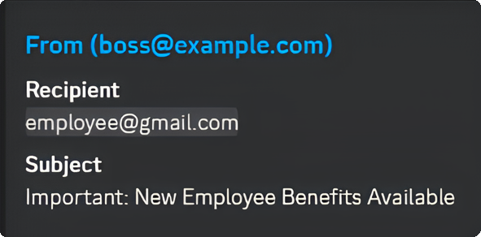
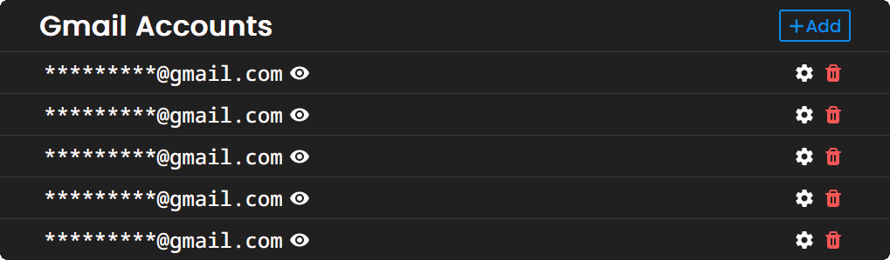
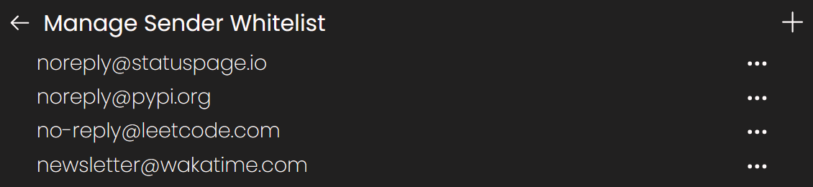

## Receive alerts for new emails from the comfort of your discord DMs.

[Website](https://enotify.lucism.dev) - [Get Started](https://enotify-docs.lucism.dev) - [Self Host](https://enotify-docs.lucism.dev/self-host) - [Support](#TODO)

## Overview

- Receive incoming email alerts in Discord DMS

- Add as many email accounts as you need

- Configure alert settings on a per email account basis

